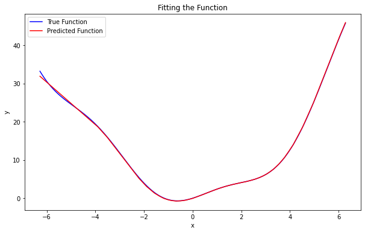
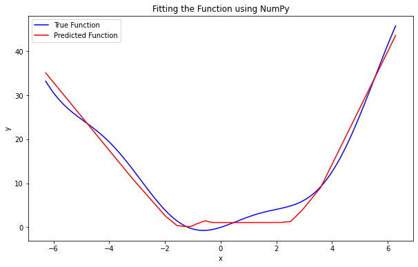

# 函数拟合报告

## 用tensorflow来拟合函数

### 函数定义

我们考虑拟合的目标函数为：

$f(x) = x^2 + x \cdot \cos(x) + \sin(x)$

```python
def target_function(x):
    return x**2 + x * np.cos(x) + np.sin(x)
```

### 数据采集

我们在区间 [-2π, 2π] 上均匀采样1000个数据点作为训练数据。

```python
x_train = np.linspace(-2*np.pi, 2*np.pi, 1000).reshape(-1, 1)
y_train = target_function(x_train)
```

### 模型描述

我们使用了一个两层的前馈神经网络来拟合目标函数。该网络包含两个隐藏层，每个隐藏层包含32个神经元，并使用ReLU激活函数。输出层为一个神经元，不使用激活函数。

```python
model = tf.keras.Sequential([
    tf.keras.layers.Dense(32, activation='relu', input_shape=(1,)),
    tf.keras.layers.Dense(32, activation='relu'),
    tf.keras.layers.Dense(1)
])
```

### 拟合效果

经过1000个epoch的训练，模型取得了较好的拟合效果。下图展示了原始函数与模型预测函数之间的比较：



从图中可以看出，模型成功拟合了原始函数，并且在大部分区域表现良好.

## 用numpy来拟合函数

### 函数定义

我们考虑拟合的目标函数为：

$f(x) = x^2 + x \cdot \cos(x) + \sin(x)$

```python
def target_function(x):
    return x**2 + x * np.cos(x) + np.sin(x)
```

### 数据采集

我们在区间 [-2π, 2π] 上均匀采样1000个数据点作为训练数据。

```python
x_train = np.linspace(-2*np.pi, 2*np.pi, 1000).reshape(-1, 1)
y_train = target_function(x_train)
```

### 模型描述

我们使用了一个两层的前馈神经网络来拟合目标函数。该网络包含两个隐藏层，每个隐藏层包含32个神经元，并使用ReLU激活函数。输出层为一个神经元。

```python
class Relu:
    def forward(self, x):
        return np.maximum(0, x)
  
    def backward(self, grad_y):
        grad_x = np.where(self.forward(grad_y) > 0, grad_y, 0)
        return grad_x

class TwoLayerNet:
    def __init__(self, input_size, hidden_size, output_size):
        self.W1 = np.random.randn(input_size, hidden_size)
        self.b1 = np.zeros(hidden_size)
        self.W2 = np.random.randn(hidden_size, output_size)
        self.b2 = np.zeros(output_size)
        self.relu = Relu()
  
    def forward(self, x):
        self.h1 = np.dot(x, self.W1) + self.b1
        self.a1 = self.relu.forward(self.h1)
        self.h2 = np.dot(self.a1, self.W2) + self.b2
        return self.h2
  
    def backward(self, x, grad_output, learning_rate):
        grad_h2 = grad_output
        grad_W2 = np.dot(self.a1.T, grad_h2)
        grad_b2 = np.sum(grad_h2, axis=0)
        grad_a1 = np.dot(grad_h2, self.W2.T)
        grad_h1 = self.relu.backward(grad_a1)
        grad_W1 = np.dot(x.T, grad_h1)
        grad_b1 = np.sum(grad_h1, axis=0)

        # Update weights and biases
        self.W1 -= learning_rate * grad_W1
        self.b1 -= learning_rate * grad_b1
        self.W2 -= learning_rate * grad_W2
        self.b2 -= learning_rate * grad_b2

# Instantiate the model
model = TwoLayerNet(input_size=1, hidden_size=32, output_size=1)

```

### 拟合效果

经过1000个epoch的训练，模型取得了较好的拟合效果。下图展示了原始函数与模型预测函数之间的比较：



从图中可以看出，模型虽然大致拟合了函数图像，但表现并不是很良好.
